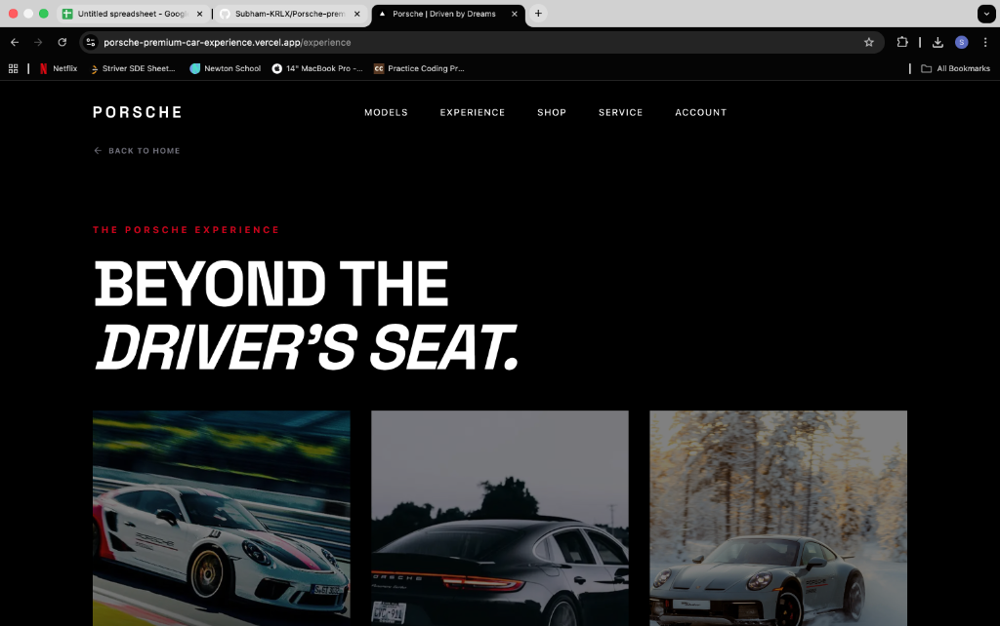
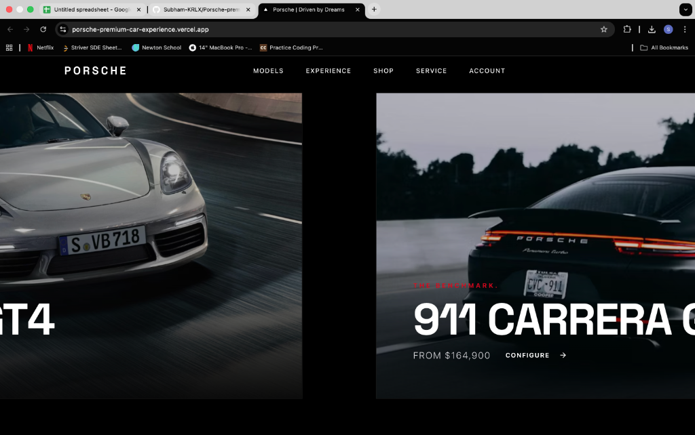
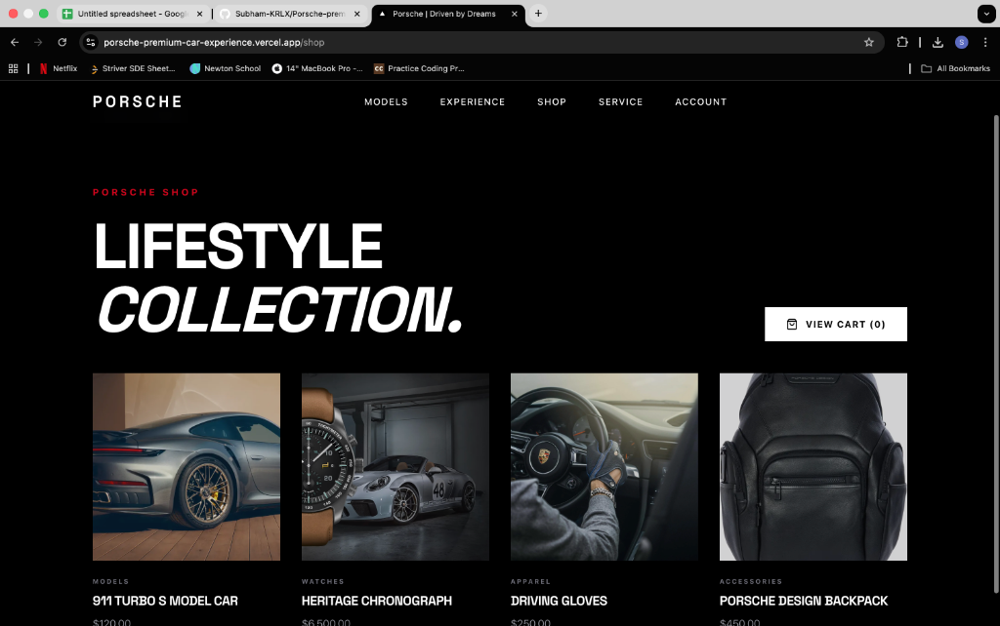
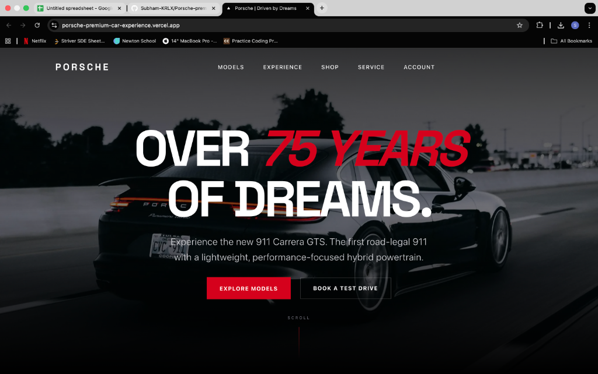

# Porsche Premium Car Experience

A premium digital experience showcasing luxury Porsche vehicles, built with modern web technologies to deliver a sleek, immersive, and high-performance user journey. This project captures the essence of the Porsche brand through fluid animations, interactive 3D elements, and a sophisticated design system.

## 📸 Project Showcase

### **The Pure Porsche Experience**
Experience the brand in its purest form with a cinematic landing page featuring immersive video backgrounds and dynamic typography.


### **Beyond The Driver’s Seat**
Explore the philosophy behind the engineering.


### **Lifestyle Collection**
A dedicated shop section showcasing the premium lifestyle accessories that accompany the drive.


### **75 Years of Dreams**
Celebrating the heritage and the future of the 911 Carrera GTS.


---

## 🛠 Tech Stack

This project is built using the bleeding edge of the Next.js ecosystem:

- **Framework**: [Next.js 15](https://nextjs.org/) (App Router)
- **Styling**: [Tailwind CSS v4](https://tailwindcss.com/)
- **Animations**:
  - [Framer Motion](https://www.framer.com/motion/) (UI Interactions)
  - [GSAP](https://gsap.com/) (Complex Sequences)
- **3D & Canvas**: [React Three Fiber](https://docs.pmnd.rs/react-three-fiber) & [Drei](https://github.com/pmndrs/drei)
- **Database & ORM**:
  - [LibSQL](https://turso.tech/libsql) (via Turso or local)
  - [Drizzle ORM](https://orm.drizzle.team/)
- **Authentication**: [Better Auth](https://www.better-auth.com/)
- **UI Components**:
  - [Radix UI](https://www.radix-ui.com/) (Primitives)
  - [Lucide React](https://lucide.dev/) (Icons)
  - [Swiper](https://swiperjs.com/) / [Embla Carousel](https://www.embla-carousel.com/)

---

## 🚀 Getting Started

Follow these steps to run the project locally.

### Prerequisites

- Node.js (v18+)
- npm

### Installation

1.  **Clone the repository:**
    ```bash
    git clone https://github.com/Subham-KRLX/Porsche-premium-car-experience.git
    cd Porsche-premium-car-experience
    ```

2.  **Install dependencies:**
    ```bash
    npm install
    # or
    npm install --legacy-peer-deps
    ```

3.  **Set up Environment Variables:**
    Create a `.env` file in the root directory. You will need to configure your database and authentication keys (e.g., Turso/LibSQL credentials, Better Auth secret).
    
    Example `.env`:
    ```env
    DATABASE_URL="libsql://your-db-url.turso.io"
    DATABASE_AUTH_TOKEN="your-auth-token"
    BETTER_AUTH_SECRET="your-secret-key"
    NEXT_PUBLIC_APP_URL="http://localhost:3000"
    ```

4.  **Run the development server:**
    ```bash
    npm run dev
    ```

5.  **Open the app:**
    Visit [http://localhost:3000](http://localhost:3000) in your browser.

## 📦 Build & Deployment

To build the application for production:

```bash
npm run build
```

This application is optimized for deployment on **Vercel**.

1.  Push your code to GitHub.
2.  Import the project in Vercel.
3.  Add the necessary Environment Variables.
4.  Deploy.

## 📄 License

This project is licensed under the MIT License.
